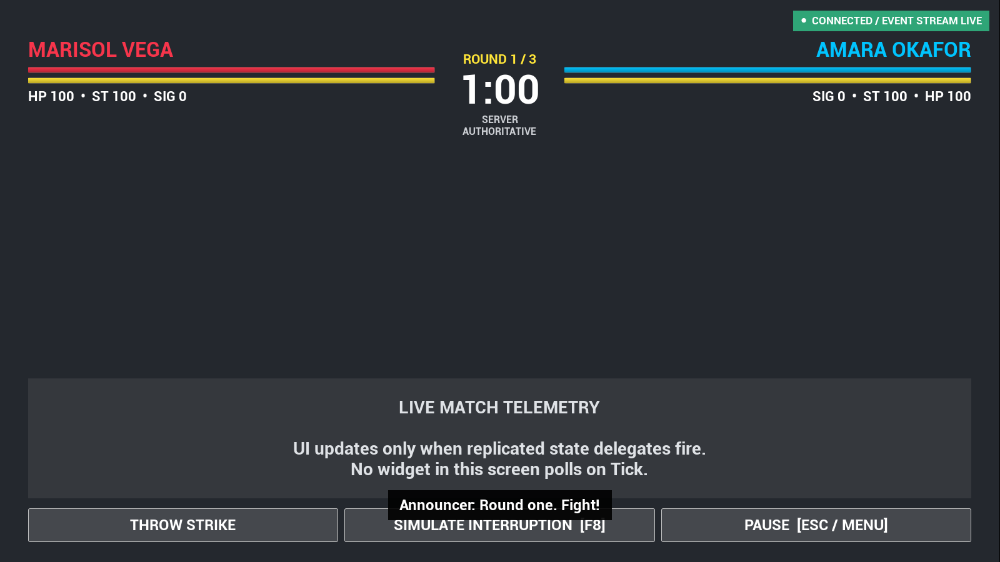
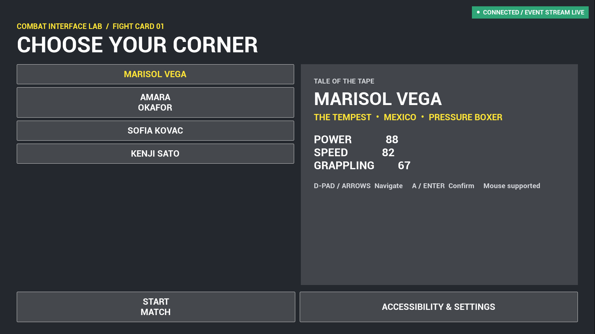
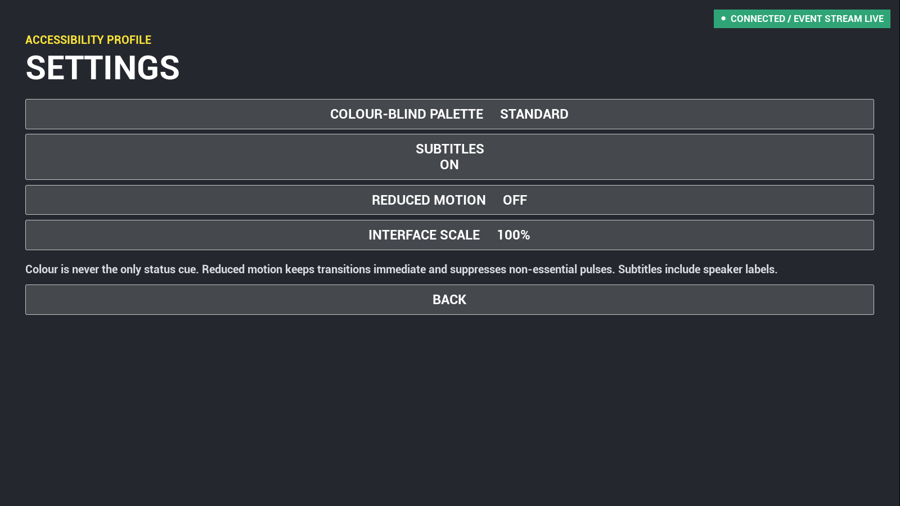
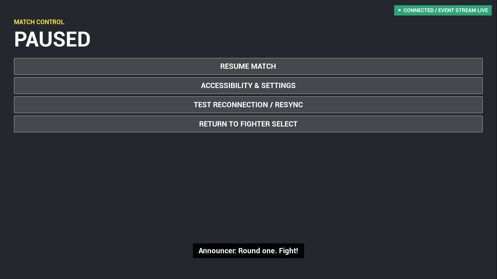
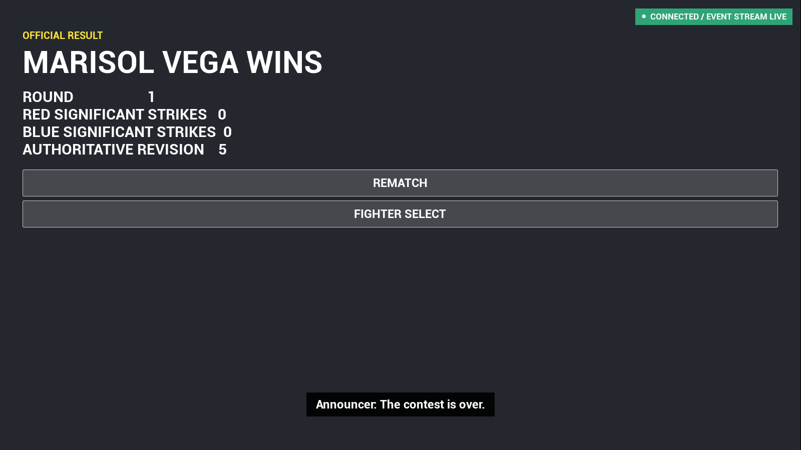

# Combat Interface Lab

**A production-minded combat UI engineering portfolio project built in Unreal Engine 5.8 and C++.**

[](https://www.unrealengine.com/)
[](Source/CombatInterfaceLab)
[](#testing)
[](https://github.com/MarvelousJade)



## Portfolio introduction

I built Combat Interface Lab to demonstrate the engineering behind a polished, controller-first sports combat interface—not only its visual presentation. The project treats UI as a network-aware gameplay system with explicit state ownership, deterministic rules, accessibility support, automated validation, and recovery from interrupted connections.

The implementation emphasizes the work I would bring to a gameplay or UI engineering role:

- Designing maintainable C++ boundaries between gameplay state and presentation
- Building server-authoritative, replicated systems that recover safely from stale state
- Creating responsive UMG interfaces for keyboard, mouse, and controller
- Treating accessibility, localization, testing, and diagnostics as core requirements
- Making performance-conscious decisions without claiming gains that have not been measured

## At a glance

| Area | Implementation |
|---|---|
| Engine | Unreal Engine 5.8 |
| Runtime | C++, UMG, Slate |
| Architecture | Presenter/state separation with immutable UI events |
| Networking | Server RPCs, replicated `GameState`, `RepNotify`, revision-based resynchronization |
| Input | Keyboard, mouse, and explicit controller focus navigation |
| Accessibility | Subtitles, reduced motion, UI scaling, and four color-vision palettes |
| Configuration | Data-only Lua fighter profiles with validated C++ fallbacks |
| Validation | 6 focused automation tests and 5 approved screenshot comparisons |
| Editor tooling | Unreal MCP integration restricted to Editor targets |

## Interface gallery

<table>
  <tr>
    <td></td>
    <td></td>
  </tr>
  <tr>
    <td align="center"><strong>Fighter selection</strong></td>
    <td align="center"><strong>Accessibility and settings</strong></td>
  </tr>
  <tr>
    <td></td>
    <td></td>
  </tr>
  <tr>
    <td align="center"><strong>Pause flow</strong></td>
    <td align="center"><strong>Match results</strong></td>
  </tr>
</table>

## Architecture

```text
Keyboard / Mouse / Controller
             |
             v
       UMG Screens
             |
             v
    C++ UI Presenter
      |             ^
      v             |
PlayerController    | RepNotify delegates
   Server RPCs      |
      |             |
      v             |
     GameMode -> Replicated GameState
                       |
                       v
              Authoritative snapshot
```

### Event-driven presentation

Widgets do not poll gameplay state on `Tick`. `ACombatMatchGameState` owns the replicated match snapshot and publishes granular delegates for vitals, timer, round, phase, and full-state changes. `UCombatUIPresenter` translates those events into presentation state, while UMG remains focused on layout, styling, focus, and interaction.

Global Slate invalidation is enabled for the project. Persistent overlay elements are refreshed only on state or screen transitions, avoiding a per-frame update path.

### Authoritative state and recovery

Match actions flow through reliable server RPCs. The server updates a revisioned `FCombatMatchSnapshot`, replication triggers `RepNotify`, and the client updates only the affected interface elements.

`F8` exercises a staged interruption flow:

1. Mark the UI as interrupted
2. Transition through reconnecting and synchronizing states
3. Request the latest server snapshot
4. Reject stale revisions during reconciliation
5. Restore the connected interface from authoritative state

This is a deterministic lab simulation of recovery behavior, designed to make the state transitions and reconciliation rules testable.

### Deterministic rules

Strike resolution, snapshot reconciliation, focus wrapping, screen transitions, and accessibility palette selection live in an independent, `UObject`-free model. This keeps core rules fast to test and separate from widget lifetime or world setup.

### Lightweight configuration

[`Content/Config/Fighters.lua`](Content/Config/Fighters.lua) is intentionally data-only. Designers can tune fighter cards without recompiling runtime code, while the C++ loader validates required fields and falls back to built-in profiles if the file is unavailable or invalid.

## UX and accessibility

- Controller-first navigation with explicit wrap behavior and visible focus
- Mouse and keyboard interaction across every screen
- Standard, deuteranopia, protanopia, and tritanopia color palettes
- Optional subtitles for announcer and system messages
- Reduced-motion preference
- Runtime interface scaling
- Responsive 16:9 design surface with safe-zone handling
- Localizable fighter display names through `FText` and `LOCTEXT`
- Persistent connection status that remains clear of primary HUD information

## Testing

The project includes **11 automated checks**:

### Six focused automation tests

- Strike and stamina rules
- Authoritative revision reconciliation
- Bidirectional controller navigation wrapping
- Valid and invalid screen transitions
- Accessibility palette differentiation
- Lua fighter catalog validation

### Five visual comparisons

Approved 1600×900 baselines cover:

- Fighter selection
- Accessibility settings
- Match HUD
- Pause
- Results

The current baselines have been validated in UE 5.8 on Windows/D3D12 with zero pixel difference in the reference environment.

Run the focused tests from **Tools → Test Automation** using the filter:

```text
CombatInterfaceLab
```

Run the screenshot suite from a Developer Command Prompt:

```bat
UnrealEditor-Cmd.exe "X:\Path\To\CombatInterfaceLab.uproject" ^
  -game -unattended -RenderOffscreen -Windowed -ForceRes ^
  -ResX=1600 -ResY=900 ^
  -ExecCmds="Automation RunTests CombatInterfaceLab.Screenshots.AllScreens; Quit" ^
  -TestExit="Automation Test Queue Empty"
```

Approved images are stored under [`Test/Screenshots`](Test/Screenshots).

## Run the project

### Requirements

- Unreal Engine 5.8
- Windows 10 or 11
- Visual Studio with C++ game development tools and a supported Windows SDK

### Setup

1. Clone the repository:

   ```bash
   git clone https://github.com/MarvelousJade/CombatInterfaceLab.git
   ```

2. Open `CombatInterfaceLab.uproject` in Unreal Engine 5.8.
3. Allow Unreal to compile the C++ module, or build the `CombatInterfaceLabEditor` target from Visual Studio.
4. Start PIE or Standalone play.

The project uses `/Engine/Maps/Entry` as a deliberately minimal background so the interface remains the focus.

## Controls

| Input | Action |
|---|---|
| D-pad / Arrow keys | Navigate |
| Controller A / Enter | Confirm |
| Mouse | Point and click |
| Escape / Controller Menu | Pause or resume |
| `F8` | Simulate interruption and authoritative resynchronization |
| `F10` | Finish the current match and show results |

## Unreal MCP workflow

Epic's experimental Unreal MCP server and supporting toolsets are enabled **only for Editor targets**. This allows trusted local tooling to inspect Slate, exercise UMG, run automation, and operate the editor without adding MCP code to packaged builds.

See [`docs/MCP.md`](docs/MCP.md) for setup and safety notes. The local endpoint defaults to:

```text
http://127.0.0.1:8018/mcp
```

## Project tour

| Path | Responsibility |
|---|---|
| [`State/CombatMatchModel.*`](Source/CombatInterfaceLab/State/CombatMatchModel.h) | Deterministic gameplay, flow, navigation, and palette rules |
| [`State/CombatMatchGameState.*`](Source/CombatInterfaceLab/State/CombatMatchGameState.h) | Replicated authoritative snapshot and diffed events |
| [`UI/CombatUIPresenter.*`](Source/CombatInterfaceLab/UI/CombatUIPresenter.h) | Screen flow and presentation-facing state |
| [`UI/CombatScreens.*`](Source/CombatInterfaceLab/UI/CombatScreens.h) | UMG screen construction and interaction |
| [`Player/CombatLabPlayerController.*`](Source/CombatInterfaceLab/Player/CombatLabPlayerController.h) | Input, RPCs, pause, and recovery orchestration |
| [`Config/CombatFighterCatalog.*`](Source/CombatInterfaceLab/Config/CombatFighterCatalog.h) | Validated data-only Lua loading |
| [`Tests`](Source/CombatInterfaceLab/Tests) | Rule, UI, configuration, and screenshot automation |

## Scope and engineering notes

This repository is a focused technical vertical slice rather than a complete fighting game. Combat is simulated to drive realistic interface changes. The interruption feature validates application-level recovery and state reconciliation; it does not emulate every platform transport failure. Screenshot baselines target the documented Windows/D3D12 reference resolution.

The project is prepared for Widget Reflector and Slate Insights analysis, but no performance-improvement figures are presented without reproducible before-and-after captures.

---

Built as a gameplay/UI engineering portfolio project by [MarvelousJade](https://github.com/MarvelousJade).
